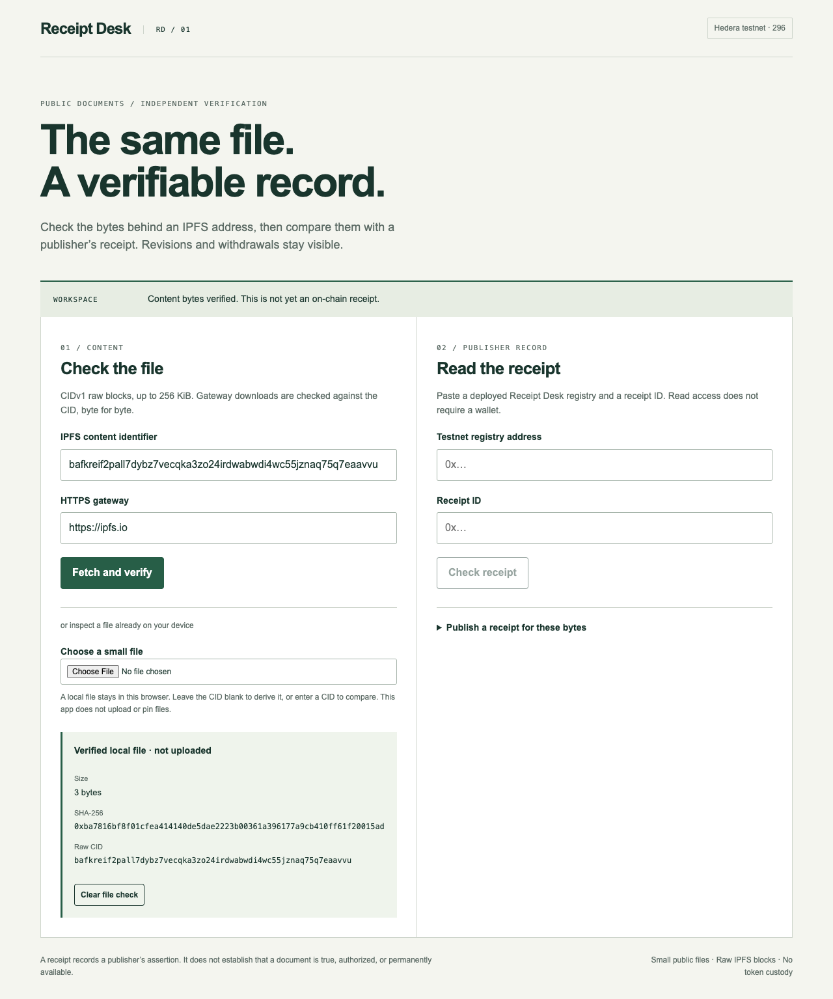

# Receipt Desk

Check public document bytes against a publisher's versioned receipt on Hedera testnet. The template combines **IPFS content addressing** with **Hedera Smart Contract Service**: the CID identifies the content, and the registry identifies the key that attested to it and preserves revisions or withdrawals.

Built with Codex. This is a new development template, not an audited production system. See [VERIFICATION.md](VERIFICATION.md) for exactly what has been checked and which submission requirements remain open.



## Quick start

Requires Node.js 22 LTS (22.14+) or 24+, and npm. Foundry (`forge`) is required for contract compilation and tests. The UI and content tests do not need a wallet, API key, or paid service.

Create a project from the public template:

```sh
npm create scaffold-hbar@latest -- receipt-desk --template waytzhang/receipt-desk-hedera --yes --skip-hedera-skills
cd receipt-desk
```

The installer needs Git and Foundry on your PATH. Version 0.4.1 also installs its default Foundry libraries; Receipt Desk's contract and contract tests do not import those libraries. Optional Hedera Skills are skipped in the command above. You can instead clone this repository and run `npm install`.

Run the checks and start the app:

```sh
npm install
npm test
npm run foundry:test
npm run lint
npm run build
npm run dev
```

Open the localhost address printed by Next.js. Select `examples/abc.txt` to check a small local file. With its CID still entered, selecting `examples/changed.txt` must produce a content mismatch and clear the previous proof. Nothing is uploaded.

The repository includes `template.json` for the `create-scaffold-hbar` community-template interface and the formatter hook used by that installer. See [VERIFICATION.md](VERIFICATION.md) for the public-repository installation check and remaining live checks. `npm run format` formats source and documentation without touching keys, environment files, or build output.

## What the workflow does

1. Enter a **CIDv1 raw block with SHA-256**, then fetch it from an HTTPS IPFS gateway. The app compares downloaded bytes with the CID's digest. Responses are limited to 256 KiB and 20 seconds. An HTTP success response alone does not pass verification.
2. Alternatively, select a local public file. With the CID field empty, the app derives its CID; with a CID entered, it verifies the file against it. This action does not publish or pin the file to IPFS.
3. Enter a deployed `ContentReceipts` testnet contract address and receipt ID. The app reads the contract, compares the content hash and byte length, and separately displays **Current**, **Superseded**, or **Revoked**. Matching bytes do not make a revoked receipt current.
4. A publisher can connect an EVM wallet on chain **296**, review the transaction, and record verified content. New versions point to a previous receipt owned by the same publisher and must retain the same context hash. Withdrawing a receipt marks it revoked while preserving its contents.

## Publish a small raw block to IPFS

Use a pinning service you control, or an existing Kubo node. This template neither bundles a public upload key nor promises permanent storage. For the sample's single-block format, Kubo can add and pin the file with:

```sh
ipfs add --cid-version=1 --raw-leaves --chunker=size-262144 examples/abc.txt
```

The resulting CID should match the app's local calculation. A public gateway must be able to retrieve the block before other people can independently fetch it. Keep a pin alive if ongoing availability matters.

The deliberately supported format is a single raw block, not a UnixFS directory or a multi-block file. Supporting arbitrary `bafy…` UnixFS CIDs requires validating their complete DAG, not comparing the file's SHA-256 directly with the root CID. The current implementation rejects that unsupported format.

## Deploy a registry to Hedera testnet

Generate or use a dedicated ECDSA testnet wallet. Obtain valueless testnet HBAR from the [official faucet](https://portal.hedera.com/faucet). Never use a funded mainnet key. The deployment script reads its key from the process environment and does not write or print it.

```sh
npm run foundry:build
# Supply HEDERA_TESTNET_PRIVATE_KEY through your local secret environment.
npm run deploy:testnet -w @sh/foundry -- --confirm-testnet
```

The script uses the official public testnet relay, checks chain 296, waits for a successful deployment, checks that code exists, and writes only public details to `packages/foundry/deployments/testnet.json`. Put the resulting address in the UI, or set `NEXT_PUBLIC_RECEIPT_REGISTRY` in `packages/nextjs/.env.local` and restart Next.js. The UI refuses wallet writes on any other chain.

For a contest submission, retain the actual deployment and recording transaction links, verify them through HashScan or the mirror node, and complete the registration/submission forms. Passing local tests is insufficient.

## Data and version rules

- `contentHash`: SHA-256 of the exact raw block bytes. The CID is derived from it using CIDv1, raw codec `0x55`, and SHA-256 multihash `0x12`; it is not an arbitrary URL.
- `byteLength`: 1–262,144 bytes, checked by the contract and content verifier.
- `contextHash`: Keccak-256 of the trimmed UTF-8 context label, distinguishing document series. The label itself is not stored by the contract. Keep the original label in your own records.
- `publisher`: transaction sender, not a verified real-world identity.
- `recordedAt`: on-chain block timestamp, not an assertion about when the document was authored.
- `predecessor` / `successor`: immutable version links. Only the publisher can extend a current, non-revoked version, once, with the same context.
- `revoked`: withdrawal flag; revocation never erases history.
- Receipt IDs bind the chain ID, registry address, publisher, hash, length, context, and predecessor. Identical replays in one registry fail; a different publisher may attest to the same file independently.

The registry cannot inspect IPFS bytes. It records publisher assertions; independent readers must verify content. It does not establish truth, copyright ownership, a person's identity, or storage availability.

## Structure and extension

`packages/core` contains browser-compatible content verification and the registry ABI. `packages/foundry` contains a dependency-free Solidity contract and tests. `packages/nextjs` contains the browser UI; it has no server upload or signing endpoint.

To add large-file support, use a full IPFS DAG verifier and revisit streaming limits. To add storage, require each operator's own pinning credentials outside the browser bundle. To support another network, review chain configuration, deployment semantics, and receipt-domain binding; do not remove chain checks to make a failing test pass.

## References

- [Hedera template bounty brief](https://hedera.com/blog/scaffold-hbar-template-bounty/)
- [Community template processing](https://github.com/hedera-dev/create-scaffold-hbar/blob/main/contributors/TEMPLATES.md)
- [Foundry on Hedera](https://docs.hedera.com/evm/tools/foundry)
- [IPFS content addressing](https://docs.ipfs.tech/concepts/content-addressing/)
- [IPFS file formats and raw blocks](https://docs.ipfs.tech/concepts/file-systems/)

MIT licensed. No actual prize, contract award, or income is represented by this repository.
